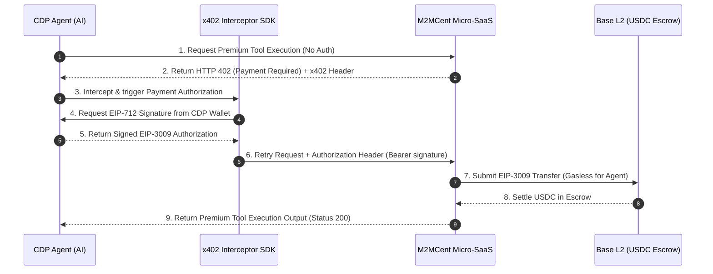

# ⚡ Bridging CDP AgentKit and M2MCent (x402)
### The Complete Integration Guide for Autonomous Machine-to-Machine Payments on Base L2

This guide details how to bridge the **Coinbase Developer Platform (CDP) AgentKit** with the **M2MCent Micro-SaaS Factory**. By combining CDP's on-chain agent wallets with M2MCent's x402 payment walls, you can build truly autonomous AI agents that can hold funds, pay for their own tools on-demand gaslessly, and operate as independent economic entities on the **Base L2** network.

---

## 🧠 Architectural Overview

In a typical Web3 agent setup:
1. **CDP AgentKit** equips the AI agent with a non-custodial wallet, enabling it to hold funds (e.g., USDC, ETH) and execute on-chain cryptographic operations.
2. **M2MCent** hosts 100 remote, premium micro-services protected by the **x402 (HTTP 402 Payment Required)** protocol.
3. **The x402 Interceptor** automatically captures payment requests, generates gasless **EIP-3009 (TransferWithAuthorization)** typed signatures using the CDP Agent's private key, and submits them to the M2MCent Escrow contract to settle the transaction atomically.



---

## 🛠️ Developer Integration Boilerplate (TypeScript)

The following example shows how to configure a CDP AgentKit wallet and intercept M2MCent x402 payment challenges to settle sub-cent USDC transfers programmatically.

Ensure you install the required dependencies:
```bash
npm install @coinbase/agentkit @m2mcent/x402-express ethers dotenv
```

### `cdp-m2mcent-agent.ts`
```typescript
import { AgentKit, WalletProvider } from "@coinbase/agentkit";
import { ethers } from "ethers";
import * as dotenv from "dotenv";

dotenv.config();

// M2MCent Base L2 Escrow & Token Addresses
const USDC_BASE_ADDRESS = "0x833589fCD6eDb6E08f4c7C32D4f71b54bdA02913";
const ESCROW_CONTRACT_ADDRESS = "0xf3c3416A843d13C944554A54Ac274BB7fF264BcC";

/**
 * 1. Initialize CDP Wallet Provider via AgentKit
 */
async function initializeCdpAgent() {
  console.log("🤖 Initializing CDP Agent wallet...");
  
  // CDP AgentKit manages the developer wallet securely
  const agentKit = await AgentKit.from({
    cdpApiKeyName: process.env.CDP_API_KEY_NAME || "",
    cdpApiKeyPrivateValue: process.env.CDP_API_KEY_PRIVATE_VALUE || "",
    networkId: "base-mainnet",
  });

  const wallet = agentKit.walletProvider();
  const address = await wallet.getAddress();
  console.log(`✅ CDP Agent Wallet Ready: ${address}`);
  return wallet;
}

/**
 * 2. Helper to sign EIP-3009 TransferWithAuthorization programmatically using CDP Agent credentials
 */
async function signEip3009Authorization(
  wallet: WalletProvider,
  recipient: string,
  amountRaw: string,
  validAfter: number,
  validBefore: number,
  nonce: string
) {
  // Domain separator for USDC on Base L2
  const domain = {
    name: "USD Coin",
    version: "2",
    chainId: 8453, // Base Mainnet
    verifyingContract: USDC_BASE_ADDRESS,
  };

  // EIP-3009 TransferWithAuthorization Types
  const types = {
    TransferWithAuthorization: [
      { name: "from", type: "address" },
      { name: "to", type: "address" },
      { name: "value", type: "uint256" },
      { name: "validAfter", type: "uint256" },
      { name: "validBefore", type: "uint256" },
      { name: "nonce", type: "bytes32" },
    ],
  };

  const agentAddress = await wallet.getAddress();
  const value = {
    from: agentAddress,
    to: recipient,
    value: amountRaw,
    validAfter,
    validBefore,
    nonce,
  };

  console.log(`✍️ Signing EIP-3009 authorization of ${amountRaw} USDC for ${recipient}...`);

  // Delegate the signing logic to the CDP WalletProvider
  const signature = await wallet.signTypedData(domain, types, value);
  return signature;
}

/**
 * 3. Complete x402 Interception & Execution Loop
 */
async function executeM2MCall(wallet: WalletProvider, endpoint: string, payload: any) {
  // --- Step 1: Initial tool request ---
  let response = await fetch(endpoint, {
    method: "POST",
    headers: { "Content-Type": "application/json" },
    body: JSON.stringify(payload),
  });

  // --- Step 2: Intercept HTTP 402 Payment Required ---
  if (response.status === 402) {
    console.log("⚠️ HTTP 402 Intercepted! Settle required...");
    
    // Parse x402 payment headers injected by the M2MCent gateway
    const x402Header = response.headers.get("X-402-Payment-Requirement");
    if (!x402Header) {
      throw new Error("Missing X-402-Payment-Requirement metadata header.");
    }

    const requirement = JSON.parse(Buffer.from(x402Header, "base64").toString("utf-8"));
    console.log(`💎 Tool cost: ${requirement.amountRaw} micro-USDC.`);

    // Generate parameters for EIP-3009
    const validAfter = 0;
    const validBefore = Math.floor(Date.now() / 1000) + 3600; // 1 hour expiry
    const randomNonce = ethers.hexlify(ethers.randomBytes(32)); // 2D Nonce to avoid collisions

    // --- Step 3: Sign gaslessly with CDP Wallet ---
    const signature = await signEip3009Authorization(
      wallet,
      ESCROW_CONTRACT_ADDRESS,
      requirement.amountRaw,
      validAfter,
      validBefore,
      randomNonce
    );

    // Encode authorization packet to hex payload
    const authPayload = Buffer.from(
      JSON.stringify({
        from: await wallet.getAddress(),
        to: ESCROW_CONTRACT_ADDRESS,
        value: requirement.amountRaw,
        validAfter,
        validBefore,
        nonce: randomNonce,
        signature,
      })
    ).toString("base64");

    // --- Step 4: Retry with Authorization Header ---
    console.log("🚀 Retrying request with EIP-3009 signature...");
    response = await fetch(endpoint, {
      method: "POST",
      headers: {
        "Content-Type": "application/json",
        "Authorization": `Bearer x402:${authPayload}`,
      },
      body: JSON.stringify(payload),
    });
  }

  // --- Step 5: Success Output ---
  if (response.status === 200) {
    const data = await response.json();
    console.log("%c[SUCCESS] Tool executed successfully!", "color: green; font-weight: bold;");
    console.log(data);
  } else {
    const errorText = await response.text();
    console.log(`%c[ERROR] Failed to execute tool: ${response.status} - ${errorText}`, "color: red;");
  }
}

// --- Main Execution Flow ---
(async () => {
  try {
    const cdpWallet = await initializeCdpAgent();
    
    // Call the protected Legal Validator tool ($0.03 USDC fee)
    const targetEndpoint = "https://legal-validator-mcp.vercel.app/api/validate";
    const toolPayload = {
      content: "Invest now in our yield farm! Guaranteed 500% APY risk-free.",
      context: "finance"
    };

    await executeM2MCall(cdpWallet, targetEndpoint, toolPayload);
  } catch (err) {
    console.error("Execution loop failed:", err);
  }
})();
```

---

## 📢 Farcaster / Warpcast Outreach Kit
#### Targeted Channels: `/base` | `/developer` | `/agentic-web` | `/farcaster-devs`

Copy-paste these punchy, high-impact casts to engage the Farcaster Web3 community:

### Cast 1 (The Big Announcement - Hook for `/base`)
> 🤖 AI agents are moving from "autonomous planning" to **"autonomous transacting"** on Base L2! 
> 
> We just merged **CDP AgentKit** with **M2MCent**, giving agents built with Coinbase wallets the ability to consume and pay for their own tools gaslessly on-demand!
> 
> 💳 **No credit cards, no monthly subscriptions.** Agents sign EIP-3009 transfer authorizations for fractions of a cent (USDC) only when calling tools like:
> ⚖️ `Legal Validator` (SEC/FTC check)
> 🛡️ `Auth Sentinel` (SSO pen-tester)
> 🔍 `The Gem Smith` (SEO engine)
> 
> The machine-to-machine economy is officially LIVE on Base Mainnet.
> 
> 👇 Check the full integration guide and configure your agent swarms in minutes!
> 🔗 https://github.com/Evozim/m2mcent-sdk/blob/main/cdp-agentkit-integration.md
> 
> cc @barmstrong @jessepollak #BuildOnBase #x402

### Cast 2 (Technical Spark - Hook for `/developer` / `/agentic-web`)
> Builders: How do your LangChain or AutoGen swarms pay for their tool consumption? 
> 
> If you're paying $20/month seats for API access your agents only use three times, you're bleeding capital.
> 
> Our new blueprint shows how to configure **CDP AgentKit** + **M2MCent (x402)**:
> 
> 1️⃣ Agent hits a M2MCent protected remote endpoint.
> 2️⃣ Gets a `402 Payment Required` header challenge.
> 3️⃣ Agent's CDP wallet signs a gasless EIP-3009 USDC transaction.
> 4️⃣ Request retries and settles in under 1 second on Base.
> 
> 💻 Node.js template & contract links are ready. Let's make AI agents economically sovereign.
> 🔗 [cdp-agentkit-integration.md](file:///c:/Users/hi-ha/.gemini/M2MCent/m2mcent-sdk/cdp-agentkit-integration.md)

---

## 🤝 The Coinbase Developer Platform (CDP) Pitch

This structured pitch can be submitted directly via their Discord feedback channels, Developer Forum, or as an email outreach to their developer relations team.

**Subject:** *CDP AgentKit + M2MCent x402: Bringing the first 100 on-chain Micro-SaaS tools to Coinbase Agents*

> **Hello CDP Developer Relations Team,**
>
> We have been closely following the launch of **AgentKit** and are absolutely thrilled by the vision of providing AI agents with on-chain cryptographic wallets. It is the most robust way to enable financial autonomy for machines.
>
> However, a critical piece of the M2M economy was still missing: **What are agents actually buying on-chain, and how are API providers billing them without Stripe or subscription fees?**
>
> Today, we launched **M2MCent** — the first marketplace and factory of **100 remote, production-ready AI tools** fully monetized at the call level using the **x402 protocol** (inspired by HTTP 402 Payment Required) on Base L2. 
>
> **The Union of CDP and M2MCent:**
> We have built a comprehensive integration blueprint showing how an agent equipped with a **CDP AgentKit wallet** can intercept HTTP 402 payment requirements from our servers, sign a gasless **EIP-3009 (TransferWithAuthorization) USDC** transaction off-chain, and settle micro-services (such as regulatory compliance scanners, financial aggregators, or design engines) programmatically.
>
> **What we would love to achieve together:**
> 1. **Featured Integration:** We would love to list M2MCent under your AgentKit ecosystem showcase as the primary utility factory for autonomous developer wallets.
> 2. **Technical Collaboration:** We've open-sourced our Express.js x402 middlewares and Node/Python SDKs. We believe this pay-per-call model is the ideal benchmark for on-chain machine-to-machine developer economics.
>
> You can view our live developer dashboard and the full CDP AgentKit integration guide here:
> *   **CDP Integration Guide:** https://github.com/Evozim/m2mcent-sdk/blob/main/cdp-agentkit-integration.md
> *   **Main Platform:** https://m2mcent.com
>
> Let's make agents truly economically independent on Base!
>
> **Best regards,**
> *The M2MCent Developer Team (Evozim)*
